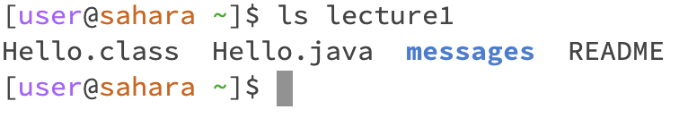

## Benjamin Nhan, 
## CSE15L
---------------------
**cd**

**No arguments:**

The working directory was previously on [user@sahara ~]$

When I used cd, nothing changed because I was "continously delivering" to nothing.
Since there are no arguments in "cd" yet, we are returned to nothing.
The output isn't an error because I was given a new line to write again with [user@sahara ~].

**Path to directory:**

The working directory was previously on [user@sahara ~]$

When I used cd lecture1 which is adding a directory in the argument of cd, the code didn't change anything in the file but changed my location in the terminal. so it became [user@sahara ~/lecture1]$ because I was continously delivered to lecture. Now if I type ls, I can see all the files within lecture1.
The output isn't a error because I was given a fresh command line saying user@sahara ~/lecture1]$

**Path to a file:**

The working directory was previously on [user@sahara ~/lecture1]$

When I used cd messages, I moved from the directory lecture1 to /messages which changed my termimal prompt to [user@sahara ~/lecture1/messages]$. This only changed the output I get from ls because I'm now in a different space than I was previously.
The output isn't a error because I was given a new command line that directly spells out where I am.

---------------------

**ls**

**No argument:**

The working directory was previously on [user@sahara ~]$

The output of ls was only lecture1 because it had no arguments, it only gave the face value list of the current directory or what is seen first on the workspace.
There is no output error because we can always ls to see what files are available to cd into next.

**Path to directory**:

The working directory was previously on [user@sahara ~]$

The output of ls lecture1 was every file listed inside of lecture1 which was  Hello.class  Hello.java  messages and  README. This is because we added the argument lecture1 that we got to enter that find and return a list of the files in the argument directory
There is no output error because we are allowed to enter one file from our current position to apply ls

**Path to a file:**

The working directory was previously on [user@sahara ~]$

The output of ls messages which is toward a file doesn't work because we are currently at the default "home page". This output is a error because we cannot skip the first directory being lecture1. Hence the new output is ls lecture1/messages which allows a direct path to messages outputing en-us.txt  es-mx.txt  ja.txt  zh-cn.txt. This version has no output error since it returns text file names and sends back the default command prompt

The working directory was previously on [user@sahara ~]$

However there is another way of finding a path to file using ls which is first cd lecture1, and then ls messages which gives the same output as ls lecture1/messages. There is no output error here because we directed to lecture1 and then listed a file inside of lecture1.

---------------------

**cat**

**No argument:**c

**ath to directory:**

**Path to a file:**

you cannot contanenate with a directory 
