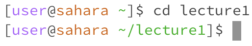
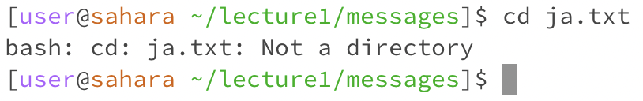

cd

The working directory was previously on [user@sahara ~]

When I used cd, nothing changed because I was "continously delivering" to nothing.
Since there are no arguments in "cd" yet, we are returned to nothing.
The output isn't an error because I was given a new line to write again with [user@sahara ~].

ls

cat

you cannot contanenate with a directory 
