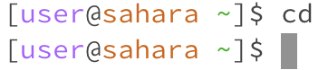

## Benjamin Nhan, 
## CSE15L
---
## **cd**

- **No arguments:**

*The working directory was previously on [user@sahara ~]$*

When I used cd, nothing changed because I was "continously delivering" to the default root directory "~".
Since there are no arguments in "cd" yet, we are returned to the same spot.
The output isn't an error because I was given a new line to write again with [user@sahara ~].

- **Path to directory:**

*The working directory was previously on [user@sahara ~]$*

When I used cd lecture1 which is adding a directory in the argument of cd, the code didn't change anything in the file but changed my location in the terminal. so it became [user@sahara ~/lecture1]$ because I was continously delivered to lecture. Now if I type ls, I can see all the files within lecture1.
The output isn't a error because I was given a fresh command line saying user@sahara ~/lecture1]$

- **Path to a file:**

*The working directory was previously on [user@sahara ~/lecture1]$*

When I used cd messages, I moved from the directory lecture1 to /messages which changed my termimal prompt to [user@sahara ~/lecture1/messages]$. This only changed the output I get from ls because I'm now in a different space than I was previously.
The output isn't a error because the code moved me correclty and I have my command prompt again.

---

## **ls**

- **No argument:**

*The working directory was previously on [user@sahara ~]$*

The output of ls was only lecture1 because it had no arguments, it only gave the face value list of the current directory or what is seen first on the workspace.
There is no output error because we can always ls to see what files are available to cd into next.

- **Path to directory**:

*The working directory was previously on [user@sahara ~]$*

The output of ls messages which is toward a file doesn't work because we are currently at the default "home page". This output is a error because we cannot skip the first directory being lecture1. Hence the new output is ls lecture1/messages which allows a direct path to messages outputing en-us.txt  es-mx.txt  ja.txt  zh-cn.txt. This version has no output error since it returns text file names and sends back the default command promptand root directory.

- **Path to a file:**

*The working directory was previously on [user@sahara ~]$*

The output of ls lecture1/messages/en-us.txt is towards a file and produces the name of our path. I believe because there is no content or paths left inside the file. This has no output error because it returns the default command prompt and root directory.

---

## **cat**

- **No argument:**

*The working directory was previously on [user@sahara ~]$*

The output of cat is an infinite loop that types back exactly what you typed. Hence, this is an error output because it isn't concatenating anything because it has no argument inside to look into. The only way to stop the loop is to use control + c which ends it and returns the standard directory prompt

- **Path to directory:**

*The working directory was previously on [user@sahara ~]$*

The output of cat lecture1 is "cat: lecture1: Is a directory". This is not an error output because it produced the fact that it wasn't a file.

*The working directory was previously on [user@sahara ~]$*

The output of cat lecture1/messages is "cat: lecture1/messages: Is a directory. This is not an error output because it produced the fact that it wasn't a file.

- **Path to a file:**

*The working directory was previously on [user@sahara ~]$*

The output of cat lecture1/messages/ja.txt is what I put in the text file for japanese translation for "Hello world!" "「こんにちは世界」". This is not an error output because the cat concatenated the ja file and printed the correct words.
