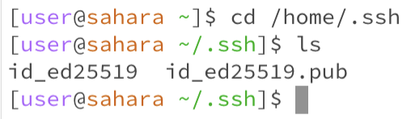
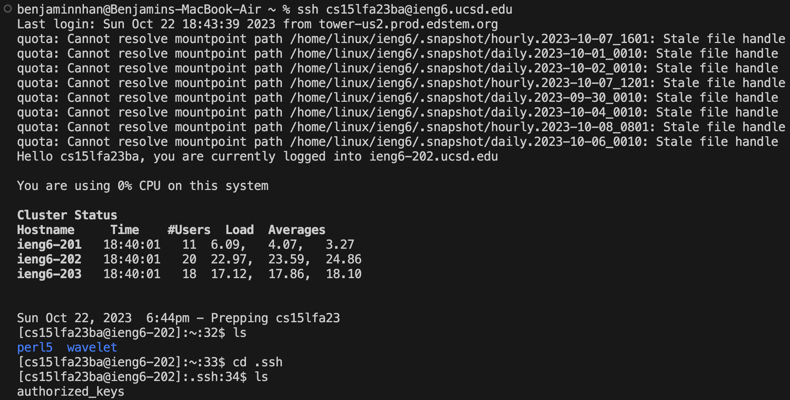
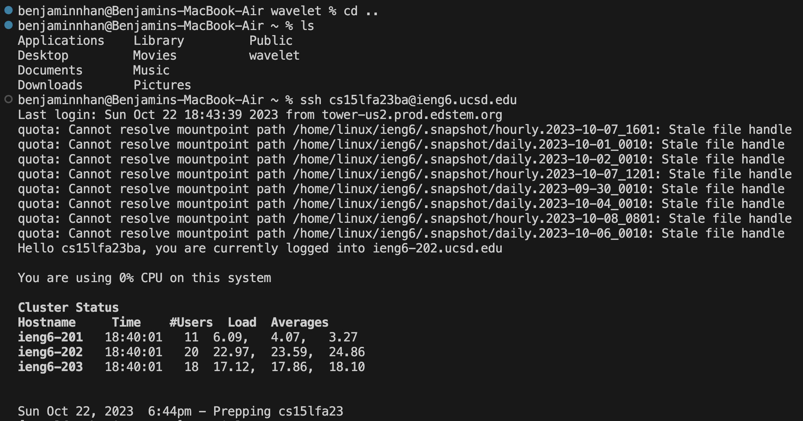

## Benjamin Nhan, 
## CSE15L
## Lab Report 2
---
## P1
**String Server code**
```
import java.io.IOException;
import java.net.URI;

class Handler implements URLHandler {
    // The one bit of state on the server: a number that will be manipulated by
    // various requests.
    String word = "";
    int num=0;
///add-message?s=<string>
    public String handleRequest(URI url) {
        if (url.getPath().equals("/")) {
            return "current list:" +"\n" +word;
        } else {
            if (url.getPath().contains("/add-message")) {
                String[] parameters = url.getQuery().split("=");
                if (parameters[0].equals("s")) {
                    num++;
                    return word += "\n" + num + ": " + parameters[1];
                }
            }
            return "404 Not Found!";
        }
    }
}
class StringServer {
    public static void main(String[] args) throws IOException {
        if(args.length == 0){
            System.out.println("Missing port number! Try any number between 1024 to 49151");
            return;
        }

        int port = Integer.parseInt(args[0]);

        Server.start(port, new Handler());
    }
}
```
**/add-message?s=....**

The server is already started so we use `StringServer` and the method is `main`. The other method would be `handleRequest` in the `Handler` class. The relevant arguement to the method handleRequest is called url which has a class type of URI. The url in the image calls the `handlersRequest function` and the input includes `path/add-message`. Then we get the query from the "?" and the 0th parameter being "s" = the string "piggy". In this image, I clicked `/add-message` 3 times and attached 3 different values to the parameter `s` which the last input happened to contain "piggy"

Specifically, we use the `String[] parameters` to start a list and we compare `parameter[0]` to "s" and if true, we increment `num` and return the string `"\n" + num + ": " + parameters[1]`. "\n" indents the line so the new `num` value with ":" and `parameter[1]` can have its own line.

If we add a word by using `?s=`, then we use the variable `word` which is returned alongside the line `word+= "\n"+num+ ": " + parameters[1]` which translates to (current position of the list)#: "". The num also increments 3 times so we see 1,2,3
The variable `word` that holds the the string list changes after every url input because it has to continually add words onto it only if we do `/add-message`. Since I added 3 words, the iteration of `word` goes 

`"\n" + 1 + ": " + "cool"`

 `"\n" + 1 + ": " + "cool"   "\n" + 2 + ": " + "aggresive"` 
 
 `"\n" + 1 + ": " + "cool"   "\n" + 2 + ": " + "aggresive"   "\n" + 3 + ": " + "piggy"`


The method would be `handleRequest` in the `Handler` class. The relevant arguement to the method handleRequest is called url which has a class type of URI. This url calls the `path/add-message` in the `handlersRequest` function which is the second if statement. Then we get the query from the "?" and the 0th parameter being `"s" = "ice cream"`.  One change here is in the url, we see the space changed into "%20". 
I have used the path `/add-message` a total of 5 times but compared to the past image, I have done 2 more `/add-message` paths containing "I like dogs" and "ice cream". Specifically, we use the `String[]` parameter to start a list and the new word would represent parameter[1]. `num++` is to increment the list to keep increasing so the words don't all stack onto 1 row. 
If we add a word using `/add-message` which means we use `?s=`, then we use the return line `word+= "\n"+num+ ": " + parameters[1]` which translates to (current position of the list)#: "".
The changes in these values is the value `word` would continually increase and the variable `num` increments everytine there is a new value so from 1,2,3,4,5.
Previously, `word` contained  `"\n" + 1 + ": " + cool"   "\n" + 2 + ": " + aggresive"`   `"\n" + 3 + ": " + piggy"` but there are now two more values added so `word` will equal

 `"\n" + 1 + ": " + "cool"   "\n" + 2 + ": " + "aggresive"   "\n" + 3 + ": " + "piggy"  "\n" + 4 + ": " + "I like dogs"`
 
 `"\n" + 1 + ": " + "cool"   "\n" + 2 + ": " + "aggresive"   "\n" + 3 + ": " + "piggy"  "\n" + 3 + ": " + "I like dogs"  "\n" + 5 + ": " + "ice cream"`
 
## P2

**Path to Private key on the computer**



**Path to Public key while logged into ieng6**


**Terminal interaction of logging in without the password**


## P3

From week 2 or 3, I've learned how to read the URL and how `paths/queries/` and reading the code for creating those paths to access some add or increment codes to work in the browser. Query being the `?` and anything after will be sifted throught the code to check whether or not that is the correct input to activate the if statement to do whatever the code wanted
I also learned how to edit the `NumberServer` to adopt into `StringServer `and use lists to make a list of words. 
