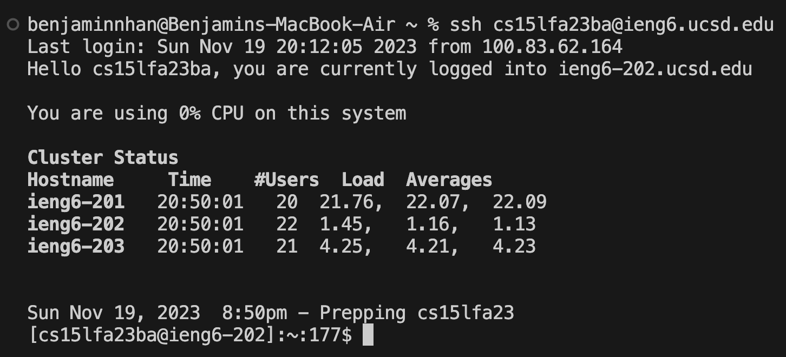
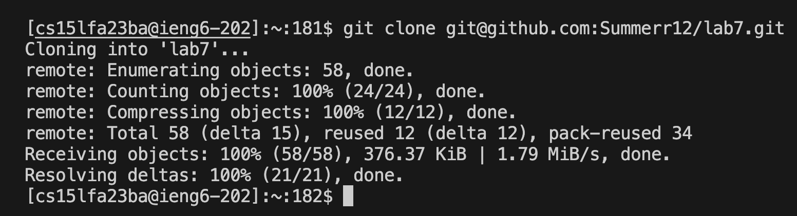
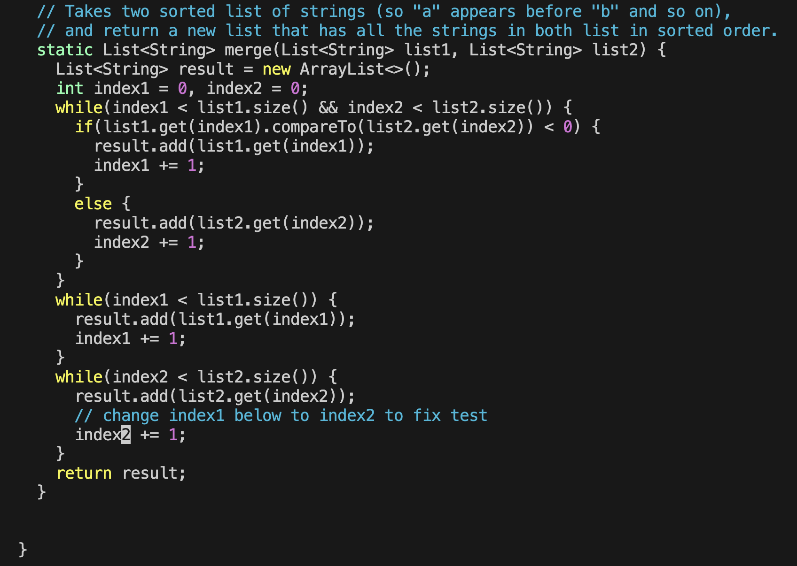
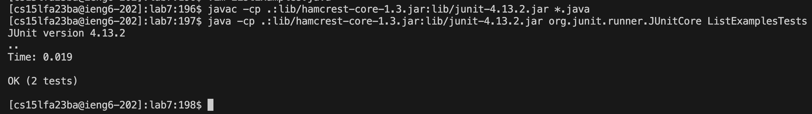
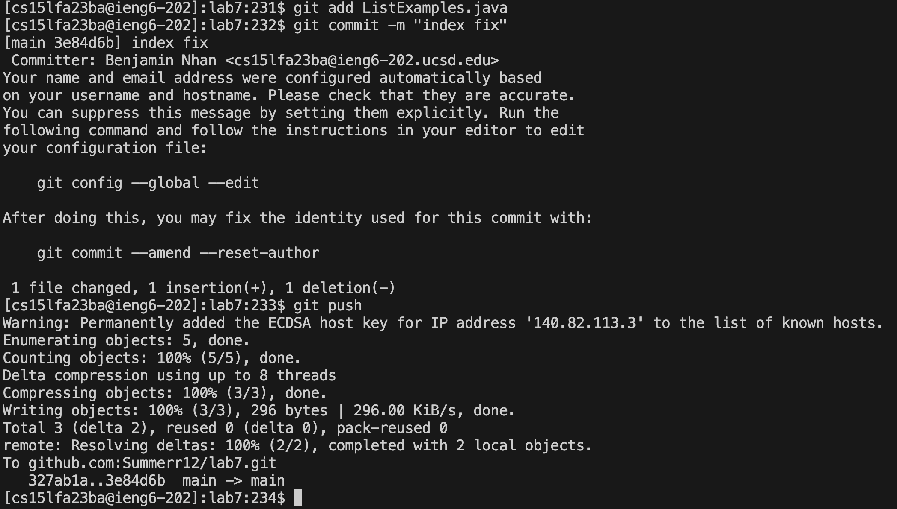

## Benjamin Nhan, 
## CSE15L
## Lab Report 4
## Week 7
---

## Step 4
**Log into ieng6**

Words typed in terminal:

`ssh cs15lfa23ba@ieng6.ucsd.edu`
`<enter>`
The ssh command connects/logs me in to a pc in the UCSD basement remotely from my device

## Step 5
**Clone your fork of the repository from your Github account (using the SSH URL)**


`git clone git@github.com:Summerr12/lab7.git`
`<enter>`
git clone clones a repositiory in which case I forked from the main repository and loads it into my ieng6 account

## Step 6
**Run the tests, demonstrating that they fail**


`cd lab7` 
`<enter>`
This changes my current directory from /home/linux/ieng6/cs15lfa23/cs15lfa23ba to /home/linux/ieng6/cs15lfa23/cs15lfa23ba/lab7

`javac -cp .:lib/hamcrest-core-1.3.jar:lib/junit-4.13.2.jar *.java` 
`<enter>`
javac compiles all the .java files inside the working directory including the junit library to help run the code with @test above

`java -cp .:lib/hamcrest-core-1.3.jar:lib/junit-4.13.2.jar org.junit.runner.JUnitCore ListExamplesTests` 
`<enter>`
java runs the code that was compiled from ListExamplesTests and shows the tests and the results that come from the code in which case is one doesn't pass through

## Step 7
**Edit the code file to fix the failing test**

`vim ListExamples.java` `<enter>`

Keys pressed:
```
shift+g
<k> 6 times
<e> (sends you to end of word)
<x> (delete character)
<i> (insert mode)
<2>
<esc>
:wq (save and quit)
<Enter>
```
vim opens a built in text editor from the terminal to let me change the failing test code
shift g sends me to the bottom of the code
`k` is like an arrow up key that takes me to my desired line
`e` sends me to the end of the first word which was the 1 inside of index1
`x` deletes a character which was the 1
`i` changes my mode to insert mode to be able to type inside the editor
`2` is the value i put inside in replacement of 1
esc takes me out of insert mode and to normal mode
`:wq` saves and quits the text editor and sends me back to the terminal


## Step 8
**Run the tests, demonstrating that they now succeed**

`<up> <up> <up> <enter>`
I went to the history by pressing up 3 times and finding `javac -cp .:lib/hamcrest-core-1.3.jar:lib/junit-4.13.2.jar *.java` 
javac compiles all the .java files inside the working directory including the junit library to help run the code with @test above

`<up> <up> <up> <enter>`
I went to the history by pressing up 3 times and finding `java -cp .:lib/hamcrest-core-1.3.jar:lib/junit-4.13.2.jar org.junit.runner.JUnitCore ListExamplesTests` and it was 3 ups again because I just entered in javac so it moves the history list 1 up
java runs the code that was compiled from ListExamplesTests and shows the tests and the results that come from the code in which case is both pass through

## Step 9
**Commit and push the resulting change to your Github account (you can pick any commit message!)**

`git add ListExamples.java`
`<enter>`

`git commit -m "index fix"`
`<enter>`

`git push`
`<enter>`

git add adds the changes I made in the working directory
git commit commits changes to the local repository with a message "index fix" because of -m
git push pushes the commited changes to the github repository
