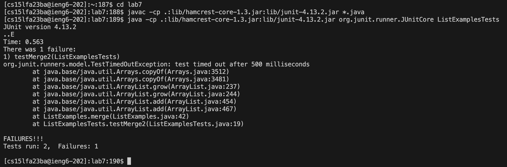

## Benjamin Nhan, 
## CSE15L
## Lab Report 3
## Week 4
---

## Step 4
**Log into ieng6**

Words typed in terminal:

`ssh cs15lfa23ba@ieng6.ucsd.edu`
`<enter>`

The ssh command connects/logs me in to a pc in the UCSD basement remotely from my device

## Step 5
**Clone your fork of the repository from your Github account (using the SSH URL)**


`git clone git@github.com:Summerr12/lab7.git`
`<enter>`

git clone clones a repositiory in which case I forked from the main repository and loads it into my ieng6 account

## Step 6
**Run the tests, demonstrating that they fail**


`cd lab7` 
`<enter>`
This changes my current directory from /home/linux/ieng6/cs15lfa23/cs15lfa23ba to /home/linux/ieng6/cs15lfa23/cs15lfa23ba/lab7

`javac -cp .:lib/hamcrest-core-1.3.jar:lib/junit-4.13.2.jar *.java` 
`<enter>`

`java -cp .:lib/hamcrest-core-1.3.jar:lib/junit-4.13.2.jar org.junit.runner.JUnitCore ListExamplesTests` 
`<enter>`

## Step 7
**Edit the code file to fix the failing test**

`vim ListExamples.java` `<enter>`

Keys pressed:
```
shift+g
<up> using <’k’> 6 times
e (sends you to end of word)
x (delete character)
i (insert mode)
2
esc
:wq (save and quit)
<Enter>
```


## Step 8
**Run the tests, demonstrating that they now succeed**

`javac -cp .:lib/hamcrest-core-1.3.jar:lib/junit-4.13.2.jar *.java` 
`<enter>`

`java -cp .:lib/hamcrest-core-1.3.jar:lib/junit-4.13.2.jar org.junit.runner.JUnitCore ListExamplesTests` 
`<enter>`

## Step 9
**Commit and push the resulting change to your Github account (you can pick any commit message!)**

`git add ListExamples.java`
`<enter>`

`git commit -m "index fix"`
`<enter>`

`git push`
`<enter>`
