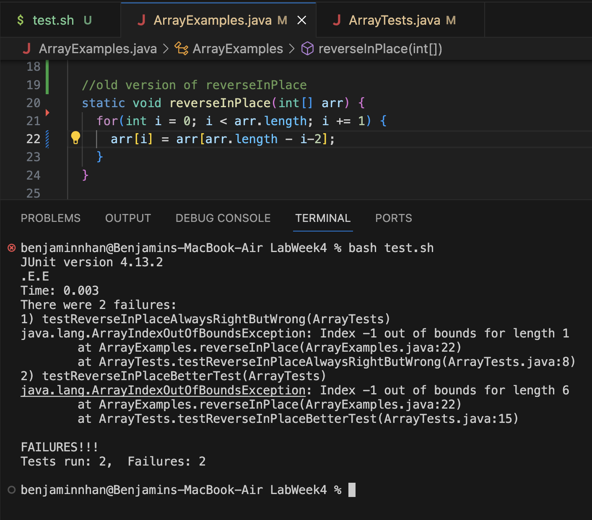
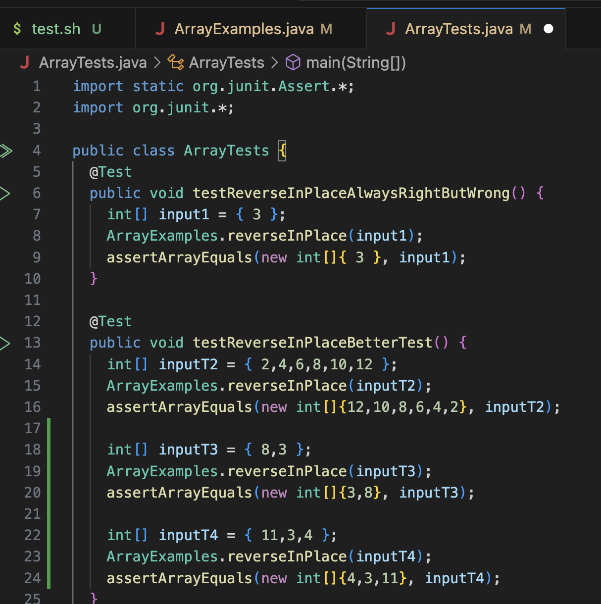
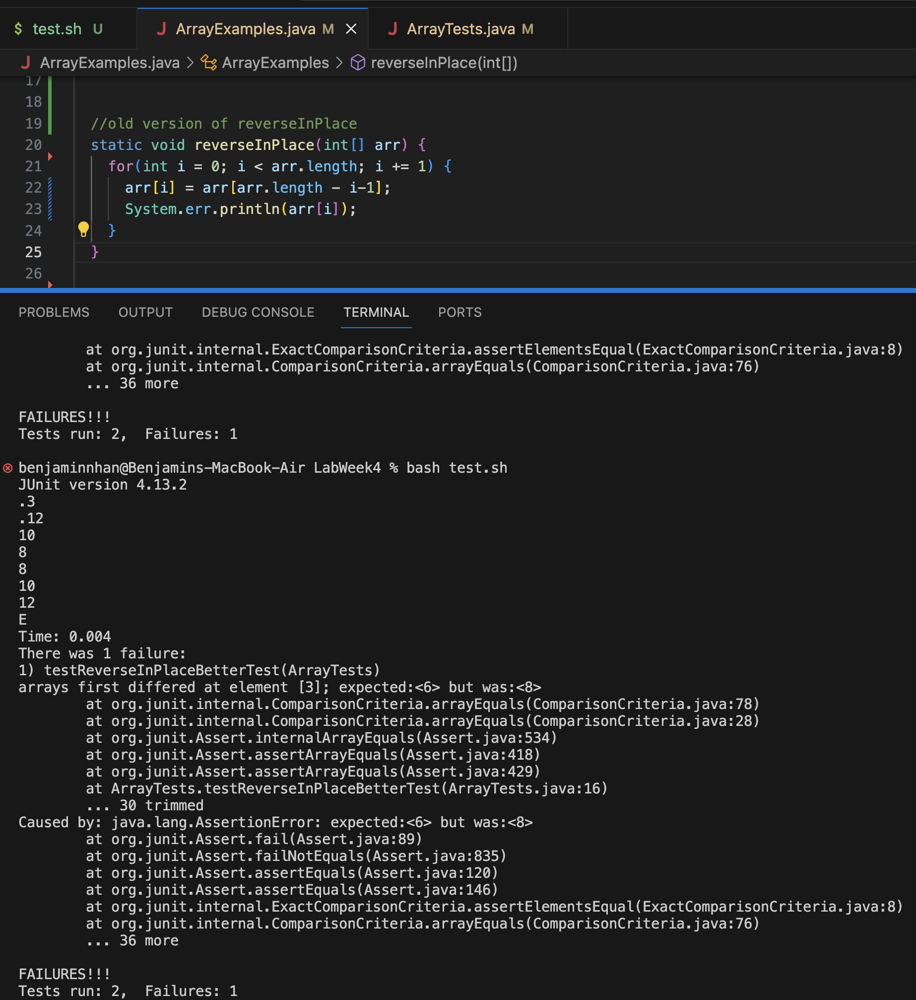
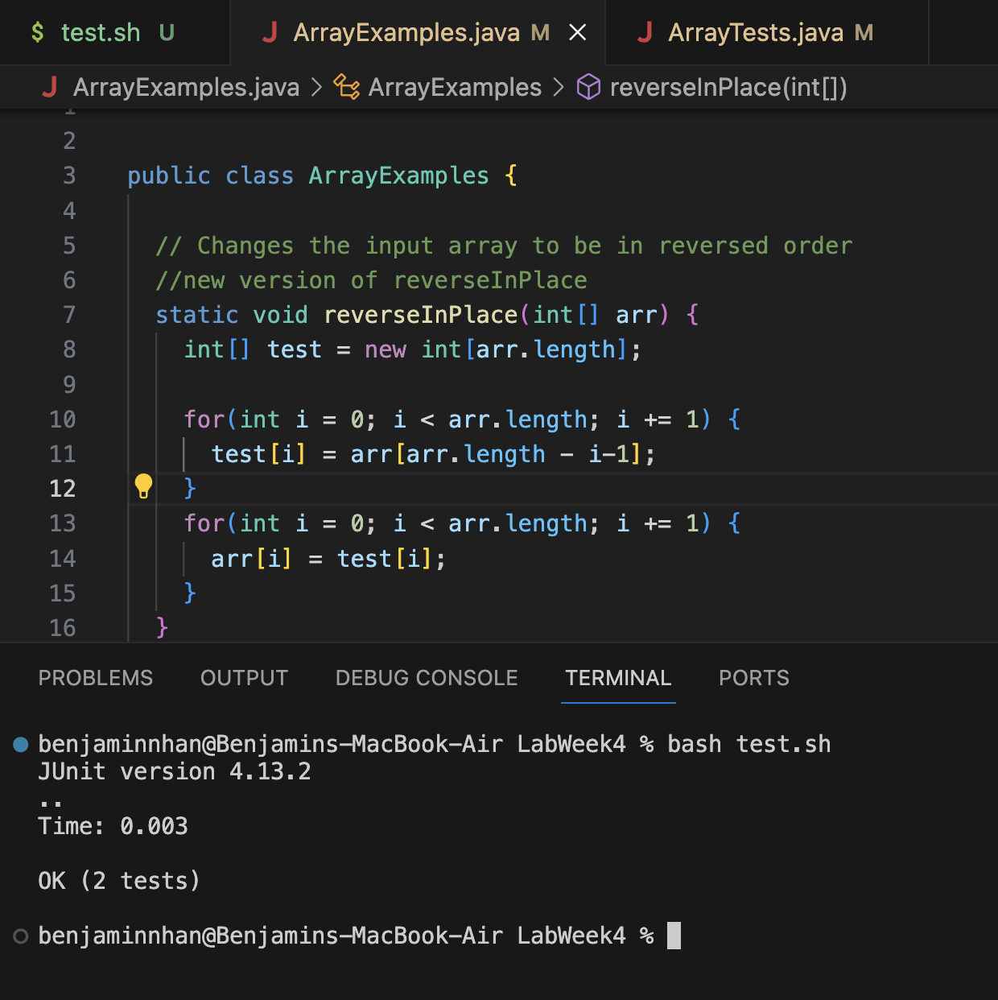
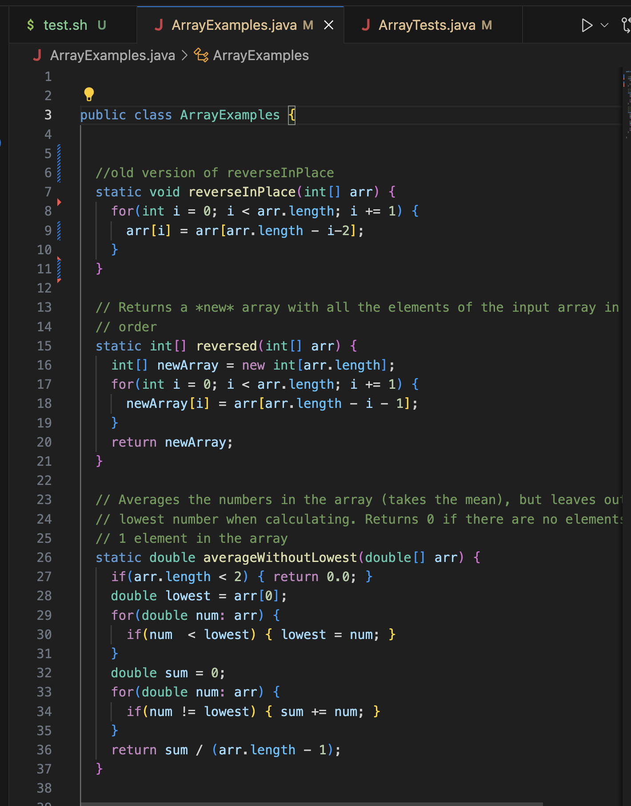
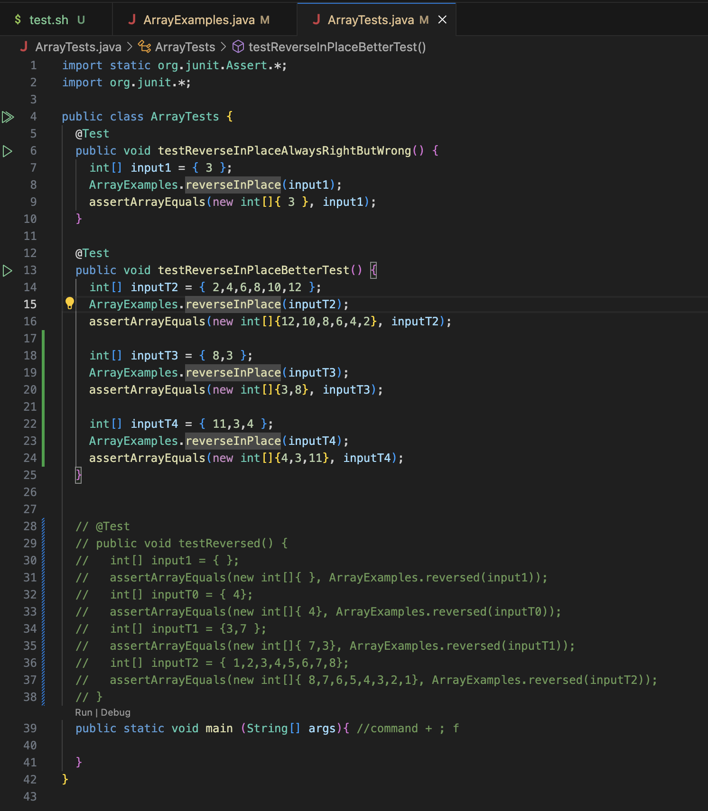
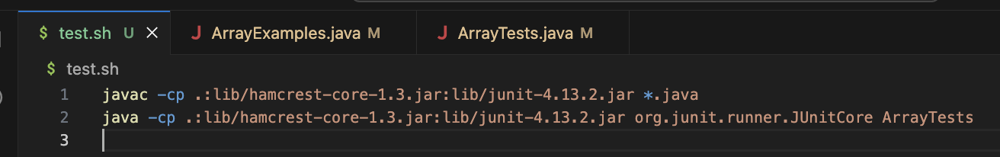

## Benjamin Nhan
## CSE15L
## Lab Report 5
## Week 9
---

## Part 1

1.
Tim: Hello! I wanted help on my week 4 lab report code. So I have an error in `ArrayExamples.java` specifically the function `reverseInPlace`. Under the image of my code and error, there is another 2 images showing my `ArrayTests.java` to show the samples of arrays I'm currently testing. Can I get help? I think im doing something wrong when trying to visit each array element but I don't know how to change it to work.




2.
TA: Good afternoon! After looking at your code, let me help you with one of your examples, I see you have an array `{3,8}` and you want the result to be `{8,3}`. What position is element 3 and 8 are? Does the element 3 return if you call for the array position 0 or 1? Whats the length of this array and how would you account for that with the first position of an array? Also a warning for your current code, try to iterate through the entire for loop and see what happens, even if you fix the out of bounds error, you will have another one.


3.
Tim: Okay so after testing, I realized the value 3 is considered `arr[0]` and the last element 8 is in position 1 so if I'm trying to find the last element, it is `length-1` and since we have a length of 2 and need to get to 7. So I iterate `length-i-1` instead of `length-i-2` I also realized the larger error with how the code iterated, because it replaces the values in the same array, so we get the code to just copy it over from one side to another. For example, we use 2,4,6,8,10,12 and return 12,10,8,8,10,12 which is completely wrong. So I tried to use 2 arrays so I would add the changes to the temporary array and moved it back to the original with another for loop. Below is the images for when I failed and printing out the array to learn what I was doing and the successful code after adding a temporary array and removing the print statement when showing my successful code.




4.
  file & directory structure:
```
lib
  hamcrest-core-1.3.jar
  junit-4.13.2.jar
ArrayExamples.class
ArrayExamples.java  
ArrayTests.class  
ArrayTests.java  
FileExample.class 
FileExample.java 
LinkedList.class 
LinkedListExample.java
ListExamples.class
ListExamples.java
Node.class
StringChecker.class
test.sh
```

contents of each file before fixing the bug:
The only files that were changed was `ArrayExamples.java`



The full command line (or lines) you ran to trigger the bug:
`bash test.sh`


A description of what to edit to fix the bug:
To fix the bug where we get an out of bound we changed the line `arr[i] = arr[arr.length - i-2];` to `test[i] = arr[arr.length - i-1];` so a -2 to a -1 because 2 would not find any value in position after the first iteration. We also changed the first line from arr to test because we want to put the reversed values inside a temporary array and put the resulting values from the temporary array to move to the original array. This means we also need another for loop which will be below:
```
for(int i = 0; i < arr.length; i += 1) {
      arr[i] = test[i];
   }
```
This for loop will be placed after the regular for loop where we are doing the actual reverse of an array

---
## Part 2

Something l learned  from the 2nd half of the quarter was that there was a text editor in the terminal. For the longest time I thought I would always need to open up a browser or app based text editor. However vim showed me otherwise. While it’s unconventional, if I needed to do any small changes why working in the terminal, it is possible with vim. I loved the application of using certain keystrokes or combinations of key strokes to change the file and how straightforward things are. The downside is how you have to remember these key combos and get used to it to actually be efficient in vim.
